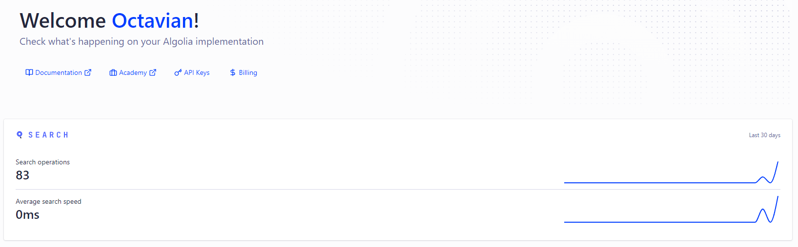

# Software Engineer Assignment - Veridion

## Introduction

This project is a Python application that extracts a set of data points from a predefined list of websites of different companies, and analyses and stores the data, using search engine technology to retrieve the profiles of those companies.

## Features

- Recursive web scraping for phone numbers, social media links, and geolocated addresses with a base speed of 7 minutes
- Quick analysis of the coverage and obtained filling rates
- Company profile building and storing in JSON format further used in querying and data retrieving
- Algolia Search Engine index building, record population, and searchable attributes configuration
- Minimalist Flask server application used for building a REST API that accepts pieces of information about a company as input, builds a specific query and runs the Algolia search with an average search speed of <1ms
- Demo client application used for testing the API with input samples

## Setup

```shell
# Installing the required modules
pip install -r requirements.txt

# For Data Extraction run the main.py file
python main.py

# Starting the Flask server for Data Retrieval
python -m flask run

# Running the demo client for querying and testing the API
python client.py
```

## Description

The scraping application runs with a classic `start()` - `infinite_update()` - `finish()` architecture.
I'm using the input csv file to build a `links` list. In order to achieve a 7-minute crawling time I'm running the http requests to every page asynchronously in the `get_responses` function.
I'm gathering every response and storing it in the `responses` list that is used inside the `update()` function for keeping track of the scraped pages.
The `scrape_page()` function returns a company profile that's to be saved in the `found_profiles` dictionary.

The `scrape_page()` function uses the BeautifulSoup module with an `html.parser` to search for social links, phone numbers and addresses and return them within a `CompanyProfile()` object.

In order to geolocate the exact address, I'm using the `geopy` module. I'm searching for either a street or a zipcode inside the webpage and I'm using those to retrieve the location point corresponding to the full address.

I'm using regex patterns to find matches for phone numbers, post-office boxes, streets, zip codes, and string-matching to find social media links.

For a better datapoint fill rate, I've implemented a recursive scraping approach with a variable number of recursions that searches for other domain-specific links inside the current page, and rescrapes the newly found links in order to populate the same `CompanyProfile()`.
The `get_href()` function returns a new URL based on whether the href has the same domain or is a redirect.
The recursive scraping can be disabled for the fastest results.

Once the `responses` list has been fully processed, I'm stopping the `update()` infinite loop and building the results.
The `json_results` is an array of `CompanyProfile()` objects used to save the records both to the Algolia index and to a local JSON file.
For every found profile, I'm updating the specific row inside the CSV file adding and populating the `addresses`, `phone_numbers`, and `social_links` columns.
For every field name, I'm creating a JSON object and appending it to the array.

Inside the `finish()` function I'm also computing the fill-rate results.

The Flask server has a GET route defined that accepts 4 arguments (name, website, phone_number, and facebook_profile) that are used in building the query for the Algolia search engine.
It returns the best matching company profile coresponding to the received input.

The client parses the CSV file that contains the API input samples and returns the results received from the server.

## Results

- Result without the recursive search 


- Result with a 10-depth recursive search


- Snapshot of the server-client interaction


- Example of a server response (with every available parameter v. with just a social link)


- Algolia dashboard

